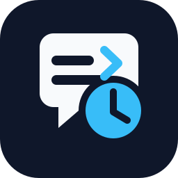

<p align="center">
  
</p>

# Prompt Later

[Website](https://prompt-later.pages.dev) · [npm](https://www.npmjs.com/package/prompt-later) · [GitHub](https://github.com/brahimhamichan/prompt-later)

Prompt Later adds `/wait` and `/steer` to Codex so you can schedule prompts for later and resume in the same session.

The delay no longer blocks inside the hook process. The hook quickly enqueues a delayed job and a small background worker processes the queue independently, so long waits are not constrained by the Codex hook timeout.

## Install

```bash
npx prompt-later
```

Restart Codex after installing. If Codex asks you to trust the new hook, approve it.

Alternative install from GitHub:

```bash
curl -fsSL https://raw.githubusercontent.com/brahimhamichan/prompt-later/main/install.sh | bash
```

## Use

```text
/wait 10s hello
/wait 1 min summarize this repo
/wait 1.5h queue run the test suite
/wait 1h 30min continue after the limit resets
/wait 2 hours steer focus only on release blockers
/steer 30 seconds keep the final answer concise
```

Supported duration forms include:

```text
1s
1 sec
1 second
1 seconds
1m
1min
1 min
1 minute
1 minutes
1h
1 hour
1 hours
1.5h
1h 30min
1 h 30 min
2 hours
```

## How It Works

Prompt Later installs:

- `~/.codex/hooks/prompt-later-hook.py`
- `~/.codex/hooks/prompt-later-worker.py`
- `~/.codex/skills/wait/SKILL.md`
- `~/.codex/skills/steer/SKILL.md`

The hook intercepts prompts that start with `/wait`, `/steer`, `$wait`, `$steer`, or Codex's linked skill form.
It parses the duration and payload, then adds a pending job to:

- `~/.codex/prompt-later/queue.json`
- `~/.codex/prompt-later/worker.pid` (while running)
- `~/.codex/prompt-later/worker.log`

Then it starts (or reuses) the worker process `~/.codex/hooks/prompt-later-worker.py`.

When a job is due, the worker resumes the original Codex session (`session_id` from hook input) with the original prompt payload. If no session id is available, it falls back to a non-interactive `codex exec` call.

When you use `/steer`, the worker sends the delayed message as:

`Steering instruction: <payload>`

## Uninstall

```bash
npx prompt-later uninstall
```

This removes the Prompt Later hook and marker skills from `~/.codex`.
